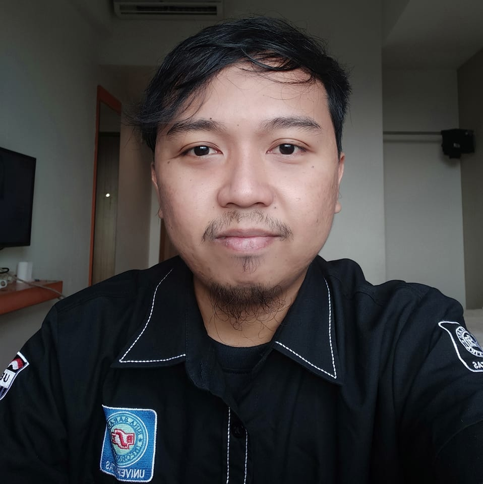
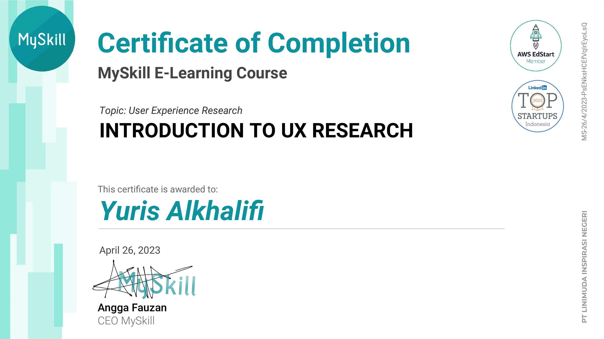
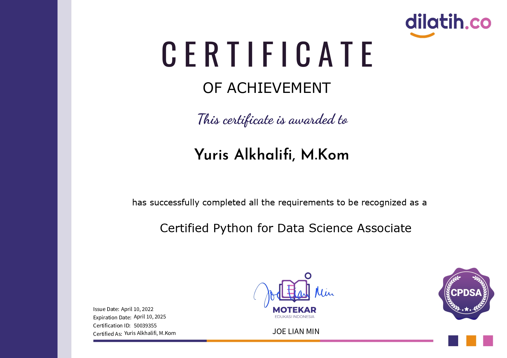
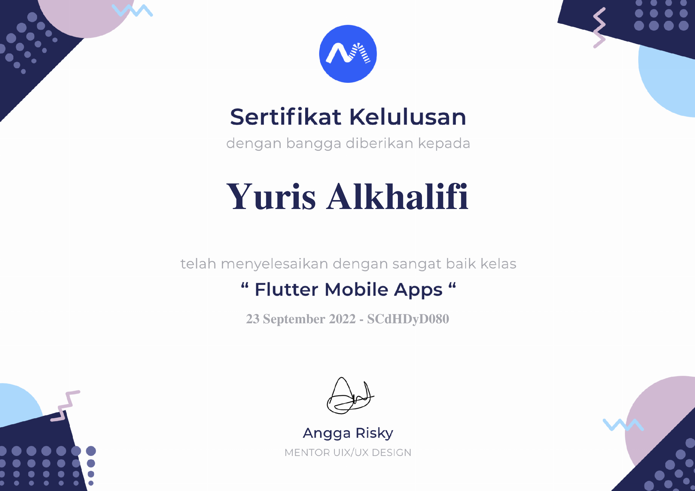
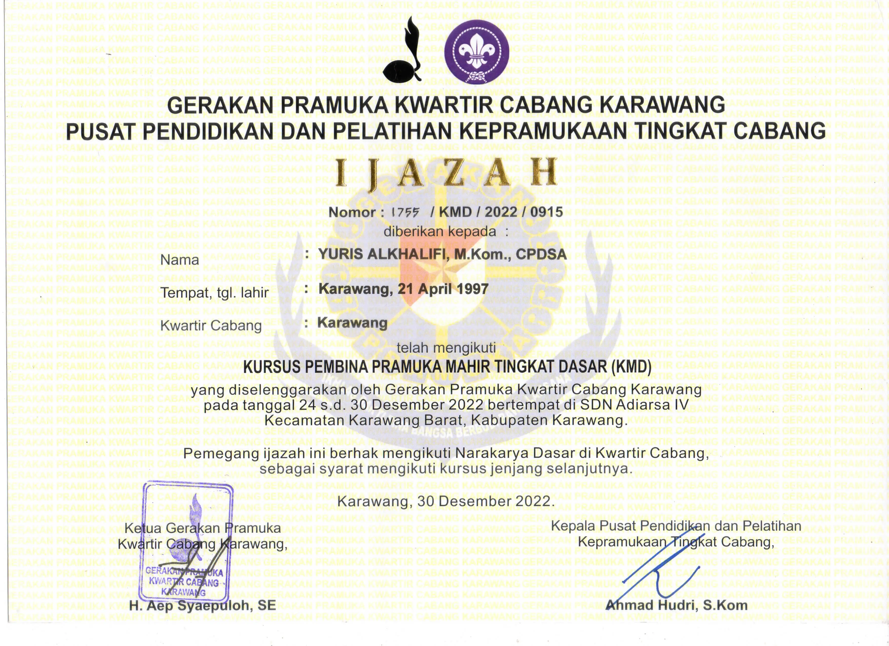

############
Tentang Saya
############

Saya adalah orang yang selalu ingin berusaha aktif dan menyesuaikan 
diri dimana saja agar dapat meningkatkan diri. Senang dengan koding
dan desain grafis, lalu aktif berorganisasi untuk memperbanyak relasi.

**********
Pendidikan
**********

====  ===================================  ========  =====================  =========  ====
#     Institusi                            Jenjang   Jurusan                Tahun      IPK
====  ===================================  ========  =====================  =========  ====
1     SMKN 1 Karawang                      SMK       Software Engineering   2012-2015  -
2     Universitas Bina Sarana Informatika  D3        Sistem Informasi       2015-2018  3,84
3     STMIK Nusa Mandiri                   S1        Sistem Informasi       2018-2019  3,86
4     Universitas Nusa Mandiri             S2        Ilmu Komputer          2019-2021  3,80
====  ===================================  ========  =====================  =========  ====

*********************
Pengalaman Organisasi
*********************

- `Kepala Divisi Desain Grafis - Repal Community - SMKN 1 Karawang (2013-2014)`
- `Ketua Bidang Pembinaan & Pengembangan - Dewan Kerja Cabang Gerakan Pramuka Kab.Karawang (2015-2020)`
- `Ketua Umum - Dewan Kerja Ranting Gerakan Pramuka Kec.Karawang Barat (2016-2021)`
- `Presiden Mahasiswa - Bina Sarana Informatika Kampus Karawang (2016-2017)`
- `Ketua Umum - Himpunan Mahasiswa Manajemen Informatika HIMMI (2017-2018)`
- `Andalan Penegak & Pandega Putra - Kwartir Ranting Gerakan Pramuka Kec.Karawang Barat (2021-Sekarang)`

**********************
Pengalaman Profesional
**********************

=====================================================================
Siswa Magang Remunerasi dan Penggajian - Perum Peruri Karawang (2013)
=====================================================================
-  `Mengurus absensi pegawai, termasuk cuti kerja, sakit dan lain-lain menggunakan oracle.`
-  `Mengelola gaji seluruh karyawan di perusahaan.`

===================================================
Siswa Magang Divisi ICT - Kemdikbud Karawang (2014)
===================================================
-  `Memperbaiki data guru Karawang yang terdapat kesalahan data pada database.`
-  `Memecahkan masalah perbaikan komputer seperti sistem operasi, printer, dll.`

===============================================================
Mahasiswa Magang Divisi ICT - Pengadilan Negeri Karawang (2017)
===============================================================
-  `Menangani Jaringan komputer terkelola yang beroperasi di seluruh gedung pengadilan negeri.`
-  `Memecahkan masalah perbaikan komputer seperti sistem operasi, printer, dll.`

===============================================================
Asisten Dosen - Universitas Bina Sarana Informatika (2017-2019)
===============================================================
-  `Membantu dosen dalam mengajar kepada mahasiswa yang mengalami permasalahan di kelas.`
-  `Menggantikan dosen apabila dosen berhalangan hadir dengan persetujuan dosen.`

===========================================================
Dosen - Universitas Bina Sarana Informatika (2019-sekarang)
===========================================================
-  `Memberikan pengajaran kepada siswa sesuai dengan kurikulum berupa materi, RPS, RTM, dll.`
-  `Membantu institusi kampus sebagai staff di Divisi Informasi Publik (DIP).`

==================================================================================
IT & Full Stack Developer - Klinik Kecantikan Nastyaderm Karawang (2020 -sekarang)
==================================================================================
-  `Membangun dan mengelola sistem informasi untuk memudahkan data penjualan dan pelaporan.`
-  `Instalasi komputer operasional dan jaringan.`

*********************
Sertifikat-Sertifikat
*********************

